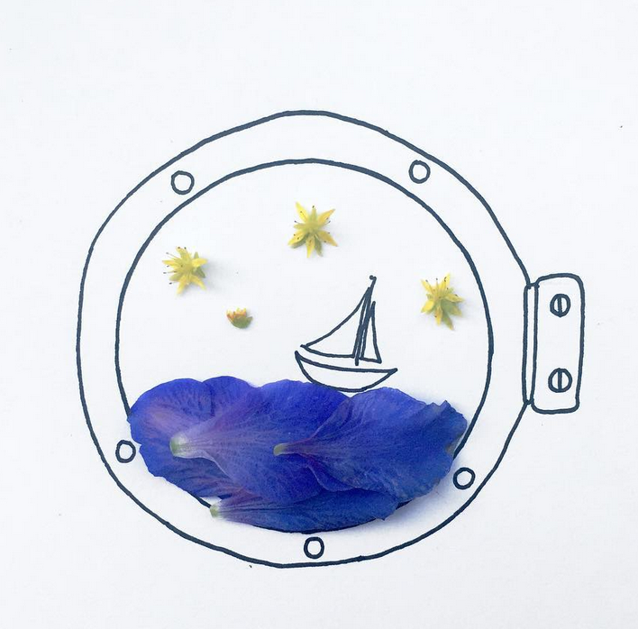
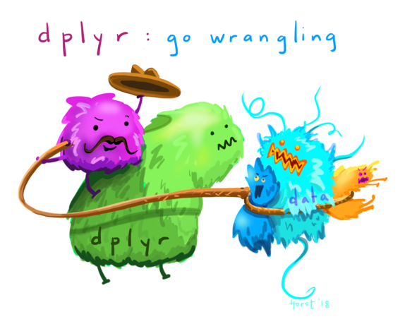
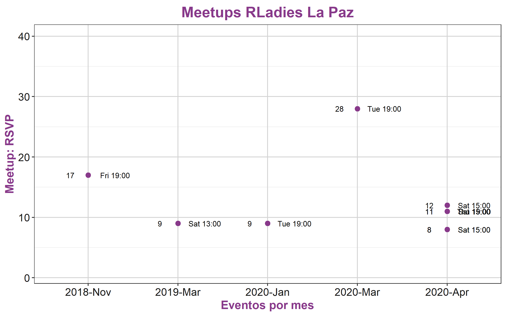
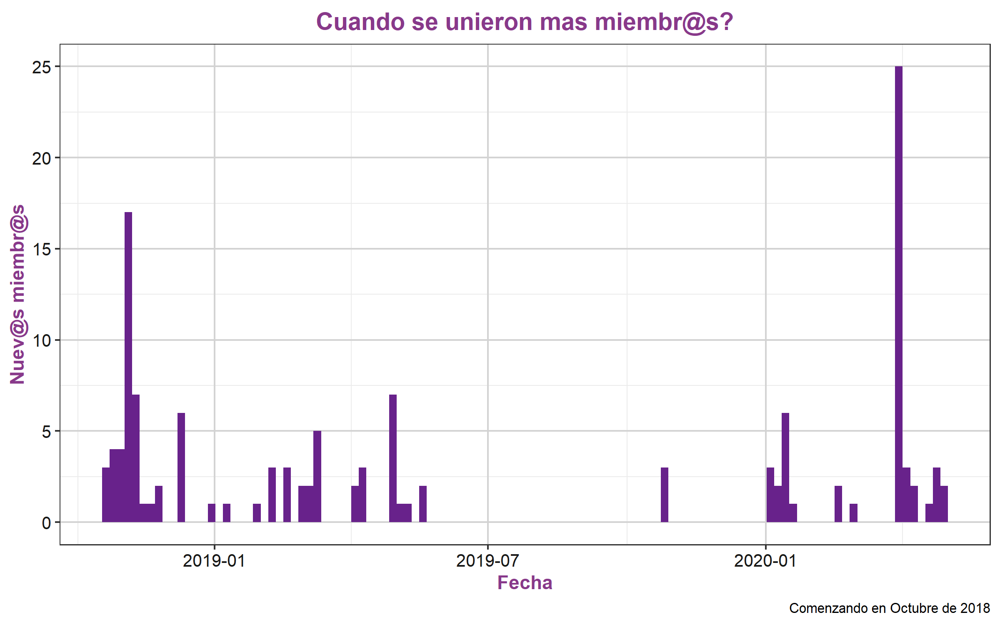

```{r setup, include=FALSE}
options(htmltools.dir.version = FALSE)
options(servr.daemon = TRUE)
```


background-image: url(https://upload.wikimedia.org/wikipedia/commons/b/be/Sharingan_triple.svg)
background-size: 100px
background-position: 90% 8%

# Sharingan

<br>
El paquete R **xaringan** viene del dōjutsu japonés **Sharingan**, del anime _Naruto_ 

con dos habilities:

--

- El ojo visionario

- El ojo del hipnotismo

--

<br>

" Creo que una presentación es una manera de presentar ideas
a una audiencia, y una gran presentación puede que llegue a
hipnotizar a la audiencia" - Yihui Xie*


*(Desarrollador de Xaringan y otros packetes de R).

---

class: middle center bg-main1

# Kunoichi
#⚔
#くノ一
# 女

--
## Es la palabra japonesa para una mujer ninja

--


---

class: middle 

## Kunoichi es un [theme] de `xaringan`


---

class: inverse, center, middle bg-main1

# Empecemos

---

# Cómo hacerlo juntas 

<br>
Instala el paquete **xaringan** desde **GitHub** 
```{r echo=FALSE, eval=TRUE}
anicon::faa('github', animate='float', rtext='@yihui')
```
[https://github.com/yihui/xaringan](https://github.com/yihui/xaringan)
  
<br>  
```{r eval=FALSE}
devtools::install_github("yihui/xaringan")
```
<br><br>
Gracias **Yihui Xie**
```{r echo=FALSE, eval=TRUE}
anicon::faa('twitter', animate='float', rtext='@xieyihui')
```
<br>
[https://twitter.com/xieyihui](https://twitter.com/xieyihui)


---
class: split-three

.row.bg-white[.content[

# Crea un nuevo Proyecto y un nuevo R markdown

  En [RStudio IDE](https://www.rstudio.com/products/rstudio/).

```
      1. New Project
      2. From the menu: File > New File > R Markdown > From Template > Ninja presentation
```      

]]
.row.bg-gray100[.content[
### luego modificamos la cabecera YAML

```
      output:
        xaringan::moon_reader:
          css: ["kunoichi", "ninjutsu" "rladies-fonts"]
```
]]
.row.bg-main1[.content[
<br>
Gracias **Emi Tanaka** 
```{r echo=FALSE, eval=TRUE}
anicon::faa('twitter', animate='float', rtext='@statsgen')

anicon::faa('github', animate='float', rtext='emitanaka')
```
<br>
<br>
Gracias **Alison Hill** 
```{r echo=FALSE, eval=TRUE}
anicon::faa('twitter', animate='float', rtext='@apreshill')
anicon::faa('github', animate='float', rtext='@apreshill')
```
]]

---
class: middle center bg-main1

# y listo!! 
## eso es todo!


---
## Para ver los resultados
<br>
- Apreta el botton **Knit** para compilar; eso significa que del R markdown R genera un archivo HTML.

<br>
- o usa ` r xaringan::inf_mr()` "Infinite Moon Reader" 
para ver cambios en tiempo real en el RStudio Viewer.

---

# Otros enlaces interesantes  


1. La librería [remark.js](https://remarkjs.com) se usa detras de la cortina para producir estas presentaciones.

1. El paquete de  [**xaringan**](https://github.com/yihui/xaringan) fue desarrollado por [Yihui Xie](https://yihui.org/en/) para hacer presentaciones. Te invito a su sitio web para aprender de sus otros paquetes (knitr, animation, bookdown, blogdown, pagedown, xaringan, y tinytex).

1. El theme de [**kunoichi**](https://github.com/emitanaka/ninja-theme) de Emi Tanaka. le agrega funcionalida al theme the R-ladies. 

1. [el theme de Rladies y las fuentes](https://alison.rbind.io/post/2017-12-18-r-ladies-presentation-ninja/) son de Alison Hill.

---
class: middle center bg-main1

# Extras

---
class: split-two white

.column.bg-white[.content[


]]

.column.bg-main1[.content.vmiddle.center[
```{r echo=FALSE, eval=TRUE}
anicon::faa('instagram', animate='float', rtext='dcossyle')
```
<br>
[https://www.instagram.com/dcossyle/](https://www.instagram.com/dcossyle/) 
<br>
```{r echo=FALSE, eval=TRUE}
anicon::faa('twitter', animate='float', rtext='dcossyle')
```
```{r echo=FALSE, eval=TRUE}
anicon::faa('github', animate='float', rtext='dcossyleon')
```
<br>
* Jirafas chiquititas!!!
<br>
[https://tinystats.github.io/teacups-giraffes-and-statistics/index.html](https://tinystats.github.io/teacups-giraffes-and-statistics/index.html)
]]

---

class: middle center



```{r echo=FALSE, eval=TRUE}
anicon::faa('github', animate='float', rtext='allisonhorst')
```
[https://github.com/allisonhorst/stats-illustrations](https://github.com/allisonhorst/stats-illustrations)


---

# Tablas

Si quieres generar tablas, te recomiendo el paquete DT:
```{r echo=FALSE, eval=TRUE}
events <- read.csv("data/events-rladies-la-paz.csv")
```
### Los eventos de R-Ladies La Paz 

```{r eval=require('DT')}
DT::datatable(events[,c(1,2,6,7)], fillContainer = FALSE)
```

---

class: middle center

```{r, out.width='65%', echo=FALSE}

```

See `scripts/01_rladiesMeetup.R`
---


class: middle center

```{r, out.width='65%', echo=FALSE}

```

See `scripts/01_rladiesMeetup.R`
---

class: middle center bg-main1


# Muchas gracias por su atención!

La presentación a sido creada con el paquete de R **xaringan** [https://github.com/yihui/xaringan](https://github.com/yihui/xaringan)
<br>
usando el theme **Kunoichi** [https://github.com/emitanaka/ninja-theme](https://github.com/emitanaka/ninja-theme).
<br><br>
Los emojies son opcionales usando el paquete **anicon** 
[https://github.com/emitanaka/anicon](https://github.com/emitanaka/anicon).
<br><br>
Recuerda que Xaringan usa **remark.js** [https://remarkjs.com](https://remarkjs.com), **knitr** [http://yihui.name/knitr](http://yihui.name/knitr), y R Markdown [https://rmarkdown.rstudio.com](https://rmarkdown.rstudio.com).
<br><br>
Para esta presentación y los datos del grupo use el paquete meetupr mucho googling, y mucha inspiración de **RLadies**.

